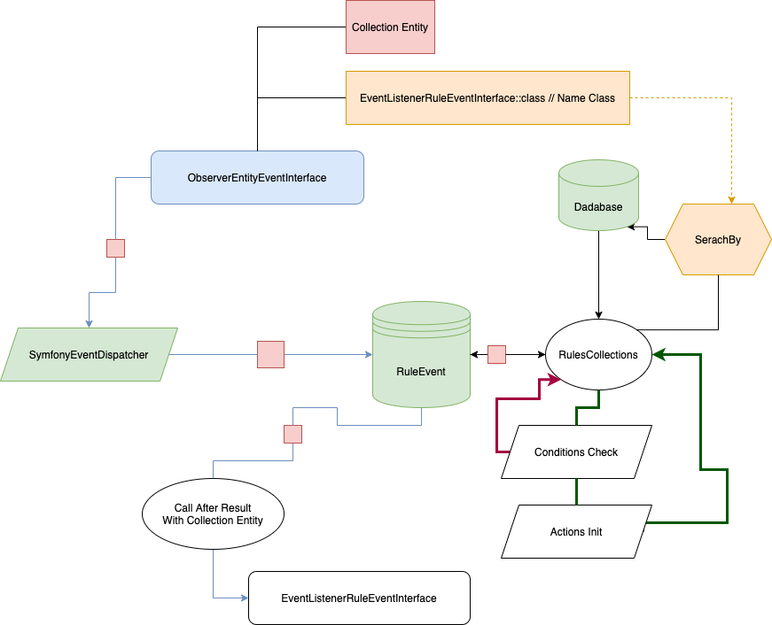

# Call event rule

### Workflow



Call use `EventDispatcherInterface` Symfony [Events and Event Listeners symfony.com](https://symfony.com/doc/current/event_dispatcher.html)

```php

use Doctrine\ORM\EntityManagerInterface;
use DrinksIt\RuleEngineBundle\Event\ObserverEntityEventInterface;
use DrinksIt\RuleEngineBundle\Event\RuleEvent;
use Symfony\Component\EventDispatcher\EventDispatcherInterface;

class MyRuleEvent implements \DrinksIt\RuleEngineBundle\Event\RuleEventInterface 
{
    private EntityManagerInterface $entityManager; 
    
    public function __construct(EntityManagerInterface $entityManager) 
    {
        $this->entityManager = $entityManager;
    }
    
    public function onEvent(iterable $data)
    {
        // income data after rules actions
        foreach ($data as $datum) {
            $this->entityManager->persist($datum);
        }
        $this->entityManager->flush();
    }
    
    public function getName() : string
    {
        return  'Name Event';
    }
}


class ObserverEntityEvent implements ObserverEntityEventInterface 
{
    
    private EntityManagerInterface $entityManager; 
    
    public function __construct( EntityManagerInterface  $entityManager) 
    {
       $this->entityManager = $entityManager;
    }
    
    public function getObservedEntities() : iterable
    {
        return $this->entityManager->getRepository('ModelName')->findAll();
    }

    public function getClassNameRuleEventInterface() : string
    {
        return MyRuleEvent::class;
    }

}

class AnotherService {
    
    protected $dispatcher;
    
    private EntityManagerInterface $entityManager;
    
    public function __construct(
        EventDispatcherInterface $dispatcher,
        EntityManagerInterface  $entityManager
    ) {
        $this->dispatcher = $dispatcher;
        $this->entityManager = $entityManager;
    }
    
    public function runService() {
        $this->dispatcher->dispatch(new ObserverEntityEvent($this->entityManager), RuleEvent::EVENT);
    }
}

```
